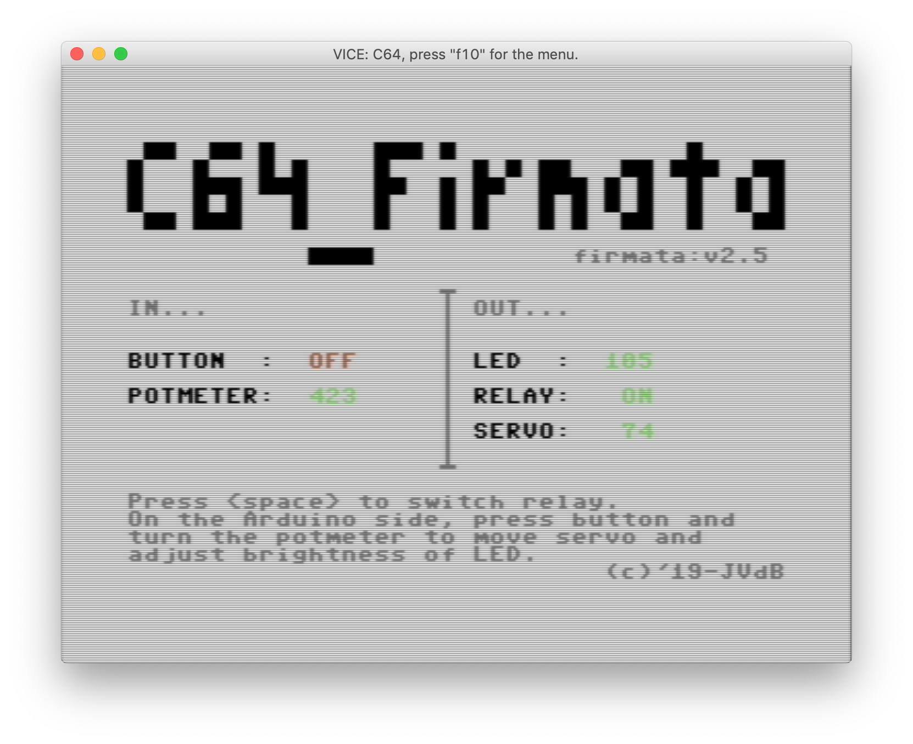

# Interface a C64 with an Arduino using Firmata.

This is a Firmata client implementation for the C64 using the userport at 2400 baud for communications.



## Prerequisites

You'll need:

  * x64
  * Arduino UNO
  * Grove shield, servo, button, LED, potmeter, relay

Optional:

  * DIY for the Grove stuff
  * A real C64
  * A way to transfer the program to the C64
  * Userport connector
  * Wires between the C64 and the Arduino UNO

## Configure x64

Plug in the Arduino, note down the device name of the Arduino (/dev/...).
Start x64 and go to the RS232 settings. Set baudrate to 2400 and device to the correct name.

## Using a real C64

```
USER PORT     ARDUINO
 N              GND
 M              RX(1)
 B,C            TX(0)

```

Power up the Arduino using a USB power plug or a power adapter.

## What's supported

  * INPUT
  * OUPUT
  * ANALOG
  * PWM
  * SERVO

## Disk image

[Download firmata.d64](https://github.com/nanoflite/C64_Firmata/releases/download/1.0/firmata.d64)

## Demo on a real C64


## Copyright

(c) 2019 Johan Van den Brande

```
  (\/)
 ( ..)
C(")(")
```
